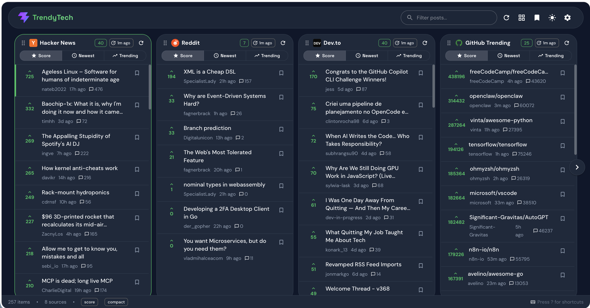

# Trendy Tech Search

A production-grade dashboard that aggregates trending tech content from multiple sources — similar to [HackerTab.dev](https://hackertab.dev/).


## Screenshot



## Features

- **11 tech sources**: Hacker News · Reddit · Dev.to · GitHub Trending · Lobste.rs · Hashnode · Product Hunt · freeCodeCamp · HackerNoon · Stack Overflow · Indie Hackers
- **Paginated column view**: Browse 4 sources per page with chevron ◀ ▶ navigation
- **Drag-and-drop columns**: Reorder feed columns with DnD Kit
- **Keyboard navigation**: Reddit-style shortcuts (j/k/h/l/o/s) + Alt+←/→ page nav
- **Dark/Light mode**: Persistent theme toggle
- **Bookmarks**: Save posts to localStorage
- **Infinite scrolling**: Load more with intersection observer
- **Search/filter**: Real-time filtering across all feeds
- **Sort modes**: Score, Newest, Trending (weighted algorithm)
- **Source customization**: Toggle sources on/off in settings
- **Compact/Grid views**: Switch between list and card layouts
- **Toast notifications**: Refresh and action feedback
- **Loading skeletons**: Smooth loading states
- **Error boundaries**: Graceful error handling
- **Code splitting**: Lazy-loaded Dashboard page
- **Responsive**: Mobile-first, works at 375px–1440px

## Tech Stack

| Category | Technology |
|----------|-----------|
| Framework | React 19 + TypeScript (strict) |
| Build | Vite 8 |
| UI Library | MUI (Material UI) v6 |
| Data Fetching | TanStack Query v5 |
| State Management | Zustand with persist middleware |
| Drag & Drop | DnD Kit |
| Fonts | Space Grotesk + DM Sans |

## Architecture

```
src/
├── api/           # API modules for each source
│   ├── client.ts            # Shared fetch client with retry & timeout
│   ├── hackernews.ts        # Hacker News (Algolia API)
│   ├── reddit.ts            # Reddit (.json endpoint)
│   ├── devto.ts             # Dev.to (Forem API)
│   ├── github.ts            # GitHub Trending (scraping)
│   ├── lobsters.ts          # Lobste.rs (JSON API via proxy)
│   ├── hashnode.ts          # Hashnode (GraphQL)
│   ├── producthunt.ts       # Product Hunt (REST API)
│   ├── freecodecamp.ts      # freeCodeCamp (Ghost API)
│   ├── hackernoon.ts        # HackerNoon (RSS feed via proxy)
│   ├── stackoverflow.ts     # Stack Overflow (SE API)
│   └── indiehackers.ts      # Indie Hackers (Firebase RTDB)
├── components/    # Reusable UI components
│   ├── Bookmarks/
│   ├── EmptyState/
│   ├── ErrorBoundary/
│   ├── FeedColumn/
│   ├── FeedItem/
│   ├── KeyboardShortcuts/
│   ├── LastUpdated/
│   ├── Layout/
│   ├── SearchBar/
│   ├── Skeleton/
│   ├── SourceIcon/
│   ├── StatusBar/
│   └── Toast/
├── hooks/         # TanStack Query hooks (one per source)
├── pages/         # Page components (Dashboard)
├── store/         # Zustand stores (preferences, search)
├── types/         # TypeScript types
├── utils/         # Utility functions (date, ranking)
├── theme.ts       # MUI theme configuration
├── App.tsx        # Root component
└── main.tsx       # Entry point
```

## Getting Started

```bash
npm install
npm run dev
```

Open [http://localhost:3000](http://localhost:3000).

## Build

```bash
npm run build
npm run preview
```

## Keyboard Shortcuts

| Key | Action |
|-----|--------|
| `j` | Move down |
| `k` | Move up |
| `h` | Move to left column |
| `l` | Move to right column |
| `o` / `Enter` | Open article |
| `s` | Toggle bookmark |
| `g` | Jump to top |
| `G` | Jump to bottom |
| `Alt + ←` | Previous page |
| `Alt + →` | Next page |
| `r` | Refresh all sources |
| `?` | Show shortcuts |

## Trending Score Algorithm

```
trendScore = score × 0.6 + comments × 0.3 + recency × 0.1
```

Where recency is a 0–1 value based on how recent the post is (1 = just posted, 0 = 24h+ old).

## Design System

Built with the UI/UX Pro Max design system:

- **Colors**: Dark tech palette (#0F172A bg, #22C55E accent)
- **Typography**: Space Grotesk (headings) + DM Sans (body)
- **Effects**: 200ms transitions, glassmorphism navbar
- **Accessibility**: prefers-reduced-motion, WCAG contrast, keyboard nav

## License

MIT
